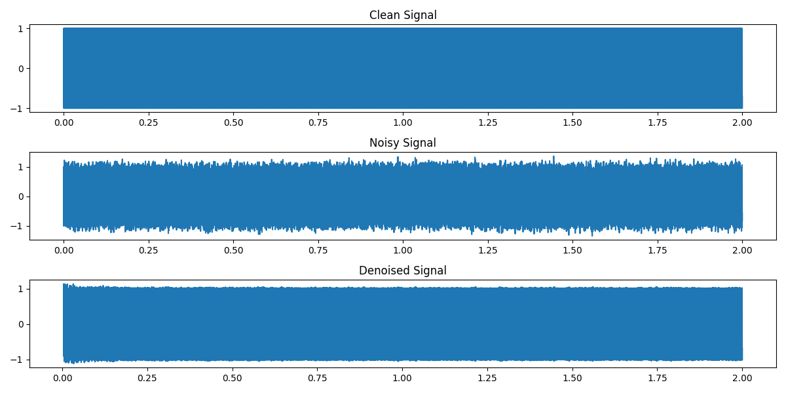

# LMS Noise Cancellation Demonstration

## Introduction to Adaptive Filters

Adaptive filters are digital tools that automatically adjust their settings to improve performance as input signals change. Unlike fixed filters, they adapt to unknown or varying conditions, making them ideal for tasks like noise cancellation, echo removal, and system modeling. In this project, we focus on noise cancellation, where the filter removes unwanted sounds to enhance a desired audio signal, such as a siren in noisy traffic.

## What is the LMS Algorithm?

The Least Mean Squares (LMS) algorithm is a widely used adaptive filtering method that minimizes the error between a desired signal and the filter’s output. It’s simple, efficient, and perfect for real-time applications like smart earphones, where it can suppress background noise to highlight important sounds.

### Key Concepts

- **Filter Coefficients (w)**: Adjustable values that shape the filter’s behavior.
- **Step Size (μ)**: Controls how quickly the filter adapts. A larger step size speeds up learning but risks instability; a smaller one is stable but slower.
- **Input Vector (x_n)**: Past samples of the noise signal.
- **Desired Signal (d_n)**: The noisy signal containing the target sound plus noise.
- **Error Signal (e_n)**: The difference between the desired signal and the filter’s output, ideally the clean signal.

The LMS update rule is:

\[ w\_{n+1} = w_n + \\mu e_n x_n \]

Where:

- (w_n): Filter coefficients at time (n)
- (\\mu): Step size
- (e_n): Error at time (n), where (e_n = d_n - y_n)
- (x_n): Input vector at time (n)
- (y_n): Filter output at time (n), where (y_n = w_n^T x_n)

This process allows LMS to adaptively cancel correlated noise, like traffic sounds, in real-time.

## Code Explanation

The Python script `lms_noise_cancellation.py` demonstrates LMS for audio noise cancellation. It generates a clean signal, adds noise, applies LMS to denoise it, and produces audio files and a plot. Below is a detailed breakdown.

### Signal Generation

A clean 1000 Hz sine wave is created, sampled at 8000 Hz for 2 seconds, simulating a clear audio signal:

```python
fs = 8000  # Sampling frequency (Hz)
duration = 2  # Duration (seconds)
t = np.arange(0, duration, 1/fs)  # Time array
clean_signal = np.sin(2 * np.pi * 1000 * t)
```

### Noise Generation

Colored noise, which has temporal correlation, is generated by filtering white Gaussian noise with a low-pass FIR filter (500 Hz cutoff, 33 taps). This mimics real-world noise like traffic, which LMS can effectively cancel:

```python
cutoff = 500  # Low-pass filter cutoff (Hz)
nyq = 0.5 * fs
num_taps = 33
taps = firwin(num_taps, cutoff/nyq, window='hamming')
white_noise = np.random.normal(0, 1, len(t))
colored_noise = lfilter(taps, 1.0, white_noise)
colored_noise = colored_noise / np.std(colored_noise) * 0.1  # Scale to std 0.1
```

### Noisy Signal

The noisy signal combines the clean signal and colored noise:

```python
noisy_signal = clean_signal + colored_noise
```

### LMS Implementation

The LMS algorithm uses a filter length (M = 32) and step size (\\mu = 0.1). The colored noise is the reference input ((u)), and the noisy signal is the desired signal ((d)). The algorithm iterates over samples, updating coefficients to produce the denoised signal ((e)):

```python
M = 32  # Filter length
mu = 0.1  # Step size
N = len(t)
u = colored_noise  # Reference noise
d = noisy_signal  # Desired signal (noisy)
y = np.zeros(N)  # Filter output
e = np.zeros(N)  # Error signal (denoised)
w = np.zeros(M)  # Filter coefficients

for k in range(M-1, N):
    x_k = u[k - M + 1 : k + 1][::-1]  # Past M samples
    y[k] = np.dot(w, x_k)  # Filter output
    e[k] = d[k] - y[k]  # Error (denoised signal)
    w = w + mu * e[k] * x_k  # Update coefficients
```

### Output and Visualization

The script plots the clean, noisy, and denoised signals and saves them as WAV files. The plot, saved as `lms_results.png`, visually confirms the noise reduction:



## Relevance to Smart Earphones

In smart earphones, LMS can suppress background noise, like traffic, to enhance critical sounds, such as emergency sirens. This aligns with the "Ear-Next" paper’s goal of improving audio clarity in dynamic environments, supporting real-time noise cancellation for better user experience.

## Prerequisites

To run the script, install:

- NumPy
- SciPy
- Matplotlib

```bash
pip install numpy scipy matplotlib
```

Run the script:

```bash
python lms_noise_cancellation.py
```

## Conclusion

This project demonstrates how LMS adaptively cancels noise in audio signals, producing clear outputs and visualizations. Its simplicity and efficiency make it ideal for applications like smart earphones, providing empirical evidence for noise suppression techniques in the "Ear-Next" paper.

## Further Reading

- Wikipedia: LMS Filter
- MATLAB: Acoustic Noise Cancellation
